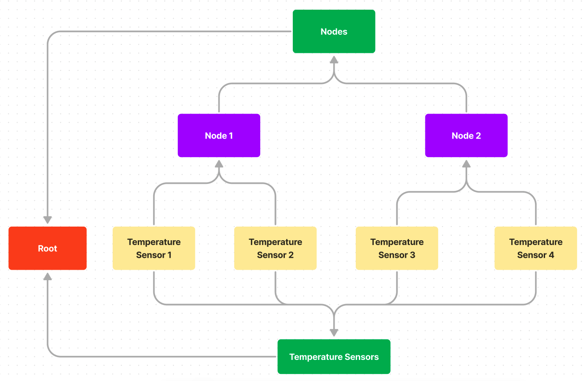
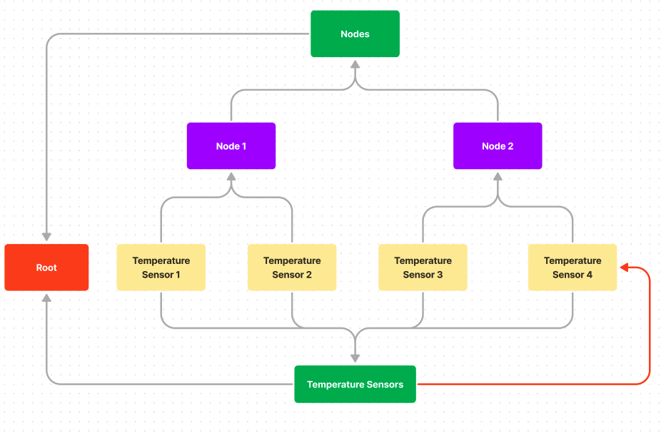

# MVP - Data Ontology

**Feature Name**: MVP - Data Ontology \
**Status**: In Progress \
**Start Date**: 2022-07-16 \
**Authors**: emilbon99 \
**Jira
Issue**: [DA-185 - Data Ontology](https://arya-analytics.atlassian.net/browse/DA-185)

# Summary

In this RFC I propose a design for a data ontology that can be used to define and
query the relationships across delta's various services. The architectural objective
is to separate the core algorithms operating on the data structures in a particular
service (segment iteration, channel command streaming, etc.) from the relationships
those data structures may have with other entities in the system.

The ontology is represented as a graph of vertexes and edges. The MVP objective is
to define an interface to this graph sustainable for long term expansion backed by
a rudimentary implementation.

# Motivation

The need for an ontology arose from the design of Delta's authorization system.
Let's say we want to block a user from writing segments to a particular channel. We
can naively approach the problem by binding a permission object to the user
stating what channels they have access to, and then add a gate somewhere in our segment
write pipeline that checks whether the user can perform the action. The fault in this  
design is that *validating the permissions of a user is not core to the algorithms
for writing segments to a channel*. By adding explicit permission checks to the
pipeline, we expand the scope of the segment writer beyond a single responsibility.

This problem appears in the user service as well. By adding explicit permission fields
and type definitions for a channel to a central `user.User` struct, we're laying the
foundation for managing the permissions of all types in the same manner. Pretty soon
we'll end up with a massive data container that depends on virtually every other package
in Delta. A large data structure with unrelated fields screams that we're going to
run into severe pain down the road.

And what if the user wants to define permissions beyond simple `user->resource`
relationships? For example, what if we want to prevent Node 1 from writing to any
channels on Node 2. Do we need to create a user account for Node 1? Do we need to
manually assign permissions for each channel? Does the user account need a password?
How do we even validate the permission? Answering these questions sustainably isn't
possible using the permissions scheme we've designed.

We'd ideally want to:

1. Remove permission fields from the `user.User` struct into a different `authorization`
   package.
2. Prevent our segment processing and user related functionality from explicitly
   depending on our `authorization` package.
3. Allow us to define arbitrary relationships between resources in the cluster without
   explicitly defining them in the code.
4. Allow different services to query and define properties on these relationships.

The need to establish abstract relationships extends beyond authorization schemes to:

1. Providing a navigable user interface and API for users. What if a user wants to see
   all channels belonging to a particular node? To a device? To a user or group? To a
   certain section of the network?
2. Communicating data changes to different services in the cluster.

# Design

## Overview

At its core, the ontology is represented by a directed, acyclic graph or
[DAG](https://en.wikipedia.org/wiki/Directed_acyclic_graph) (I'll address why I'm
using this specific graph in a moment). This graph is composed of vertexes and edges.
Vertexes represent particular resources in the cluster (channel, user, node, group,
device, etc). The edges between vertexes represent a relationship between them.

A caller can traverse the graph by following the parents and children of a vertex.
They can also define new vertexes and edges, and assign properties to them (such as
permissions).

It's important to note that the ontology does not store any concrete data. It's
vertexes and edges simply hold references to the particular service where the data
can be accessed from. It's not the responsibility of the ontology to provide
implementations for creating a new channel, device, etc. It's only it's
responsibility to characterize the relationships between (i.e. this channel belongs
to this device which belongs to this node when can be accessed by this group of users).

To make the ontology more semantic, I'm changing the names 'vertex' and 'edge' to
*resource* and *relationship*. Vertex and edge imply that a particular service adding
vertexes to the ontology should understand that it's a graph. Resource and relationship
provide a simpler view by implying that two entities share a connection.

## The Directed Acyclic Graph (DAG)

As its name suggests, a DAG has two important properties:

1. Directed - Relationships between entities have a defined hierarchy. When we build
   a relationship between a node and a channel, we'd like to say that a channel
   *belongs* to a node (and definitely not vice versa).
2. Acyclic - There can be no closed loops in the graph. This prevents an entity from
   having a relationship with itself.

In many ways, a DAG is similar to a directory with shortcuts. When opening the
command line on a Windows machine from the desktop, the executable for the program is
not actually on the desktop, and is instead in some deeply nested directory underneath
'Program Files.' The shortcut is useful, however, for providing different points of
access for the same program.

The ontology's DAG works under the same principle. We know that a temperature
sensor channel belongs to a particular node, but we also know that the same channel
could belong to a group of 'temperature sensors' that span multiple nodes. Representing
both of these relationships in a tree is impossible, but it's easy to do in a DAG:

<h6 align="middle">A simple channel ontology represented as a DAG</h6>

The location of 'Temperature Sensor 2' can be represented my the path "/temperature
sensors/temperature sensor 2" or by "nodes/node 1/temperature sensor 2". Both of
these paths are valid and intuitive ways of navigating the ontology. It just depends on
the callers needs.

It's also important to note that although this graph has undirected cycles, it does
not have any directed cycles. If we were to introduce a directed cycle like the
following

<h6 align="middle">A simple channel ontology represented as a DAG</h6>

the graph would lose its meaning; Temperature Sensor 4 belongs to the group 
temperature sensors but the group temperature sensors is also a temperature sensor? 
A directed acyclic graph allows us to define dynamic relationships between entities 
while maintaining a well-defined hierarchy.